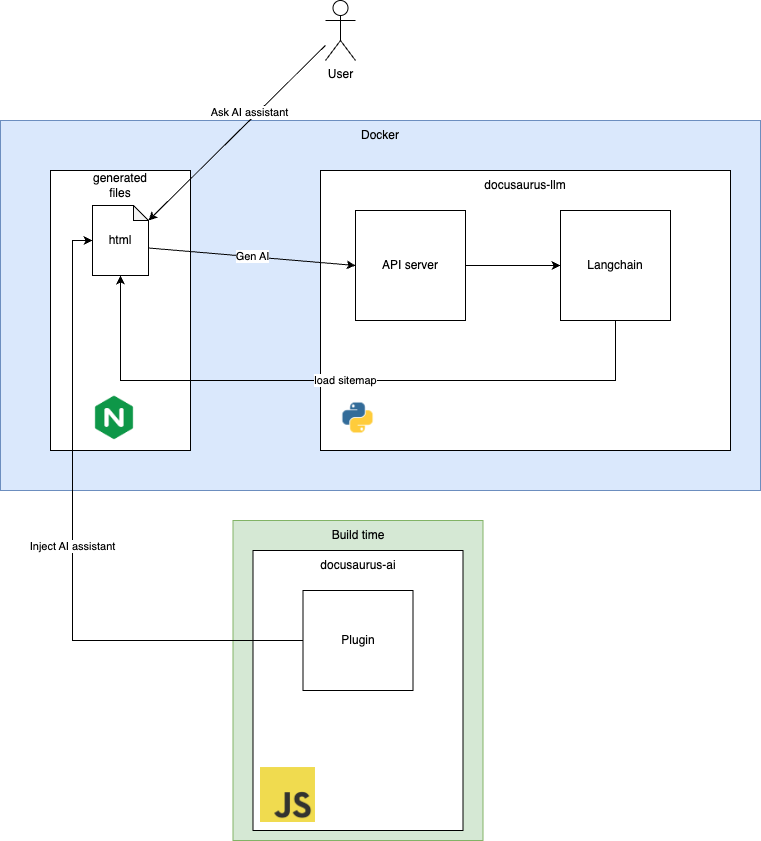

# Docusaurus AI assisstance
This is a simple AI assistance for Docusaurus generated documentation. It is a simple chatbot that can answer questions about your docs.

## Architecture


## Installation
To install the AI assisstance, you need to clone the repository and install the dependencies. You can do this by running the following commands:
```bash
git clone https://github.com/ahelmy/docusaurus-ai.git
cd docusaurus-ai
yarn install
```


## Run on Docker
1. Run `docker-compose up -d ollama` and wait to be ready.
2. Run `docker-compose exec ollama -it bash -c "ollama pull llama3.2:1b"` and wait to be ready.
3. Run `docker-compose up -d --build`
4. Open your browser and navigate to `https://docusaurus-ai.localhost` and test the AI assistant.