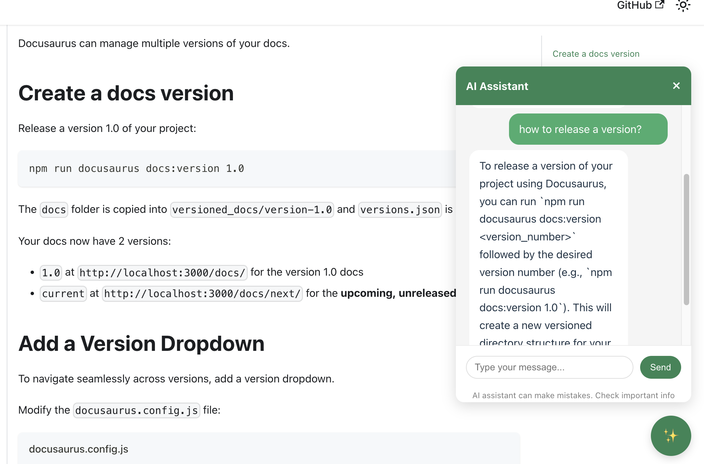

# Docusaurus MindChat

This project provides an AI-powered chat assistant for Docusaurus-generated documentation. It integrates an intelligent chatbot that can answer questions about your documentation, enhancing user experience and making information retrieval more efficient.

## Screenshots


## Architecture


## Features

- AI-powered chatbot for documentation
- Seamless integration with Docusaurus sites
- Support for multiple AI backends
- Customizable UI and behavior

## Project Structure

This is a monorepo project with the following components:

- `packages/docusaurus-mindchat`: The main Docusaurus theme/plugin package
- `demo`: A demo Docusaurus site that showcases the MindChat assistant

## Installation

### Option 1: Use the package in your existing Docusaurus site

```bash
# Install the package in your Docusaurus project
npm install @seedmindai/docusaurus-mindchat

# Or with yarn
yarn add @seedmindai/docusaurus-mindchat
```

Then add it to your `docusaurus.config.js` or `docusaurus.config.ts`:

```js
themes: [
  [
    "@seedmindai/docusaurus-mindchat", {
      chatUrl: "/api/predict",
      // other configuration options
    }
  ],
],
```

### Option 2: Clone and run the demo

```bash
# Clone the repository
git clone https://github.com/seedmindai/docusaurus-mindchat.git
cd docusaurus-mindchat

# Install dependencies
yarn install

# Build the packages (important step!)
yarn build-packages

# Start the demo site
yarn start
```

## Development Setup

If you want to contribute or modify the package:

1. Clone the repository
   ```bash
   git clone https://github.com/seedmindai/docusaurus-mindchat.git
   cd docusaurus-mindchat
   ```

2. Install dependencies
   ```bash
   yarn install
   ```

3. Build the packages
   ```bash
   yarn build-packages
   ```

4. Start the development server
   ```bash
   yarn start
   ```

## Troubleshooting

### Missing @seedmindai/docusaurus-mindchat package

If you encounter an error like:
```
Error: Docusaurus was unable to resolve the "@seedmindai/docusaurus-mindchat" theme.
```

Make sure you've built the packages first:
```bash
yarn build-packages
```

### Other common issues

- Ensure you're using a compatible Node.js version (see package.json for requirements)
- Check that all dependencies are properly installed
- Verify your configuration in docusaurus.config.js/ts

## Run on Docker

1. Run `touch .env` and add environment variable for Google Gemini API key if you want, otherwise comment out line 22-26 in `docker-compose.yml`.
2. Run `docker-compose up -d ollama` and wait to be ready.
3. Run `docker-compose exec ollama bash -c "ollama pull llama3.2:1b"` and wait to be ready.
4. Run `docker-compose up -d --build`
5. Open your browser and navigate to `https://docusaurus-mindchat.localhost` and test the AI assistant.

## License

MIT