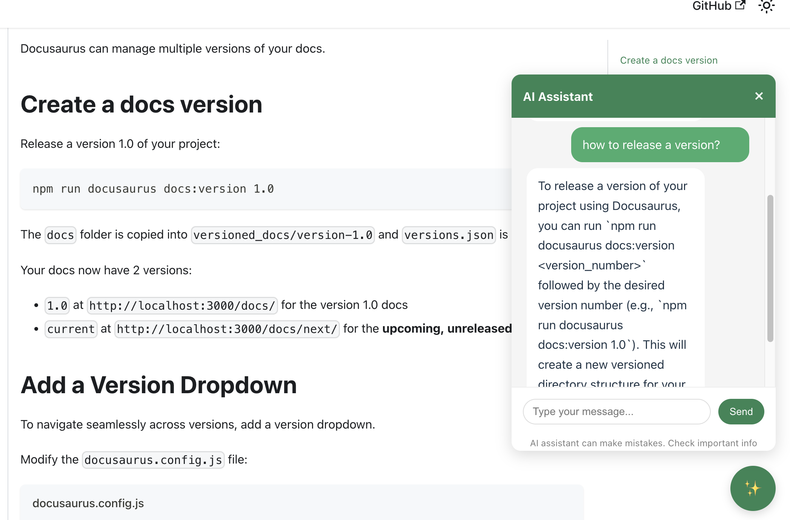
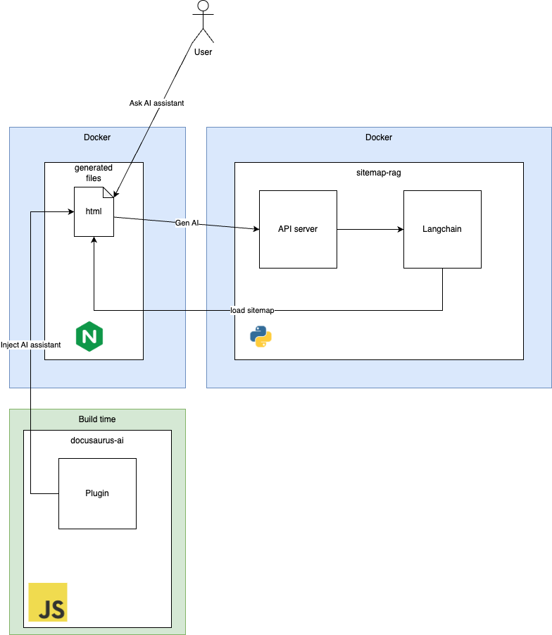

# Docusaurus AI assisstance
This is a simple AI assistance for Docusaurus generated documentation. It is a simple chatbot that can answer questions about your docs.

## Screenshots



## Architecture


## Usage
Add @ahelmy/docusaurus-ai to `docusarus.config.js` plugins array.

```js
themes: [
    [
    "@ahelmy/docusaurus-ai", {
      chatUrl: "/api/predict",
    }
    ],
    ...
  ],
```