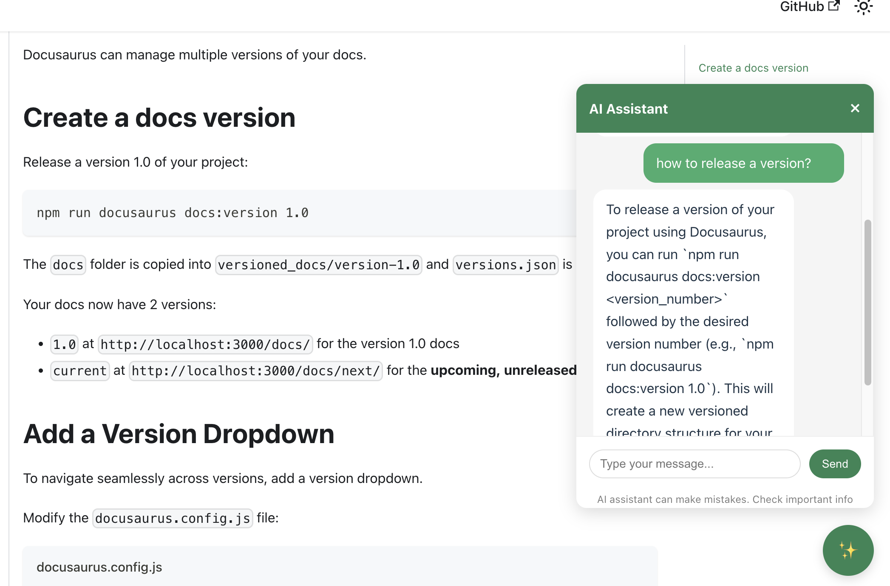

# Docusaurus MindChat

[](https://www.npmjs.com/package/@seedmindai/docusaurus-mindchat)
[](https://github.com/SeedMindAI/docusaurus-mindchat/blob/main/LICENSE)

An AI-powered chat assistant for Docusaurus documentation sites. This plugin adds an intelligent chatbot that can answer questions about your documentation, enhancing user experience and making information retrieval more efficient.

## Installation

```bash
# npm
npm install @seedmindai/docusaurus-mindchat

# yarn
yarn add @seedmindai/docusaurus-mindchat
```

## Usage

Add `@seedmindai/docusaurus-mindchat` to your `docusaurus.config.js` or `docusaurus.config.ts` file:

```js
module.exports = {
  // ... other config
  themes: [
    [
      "@seedmindai/docusaurus-mindchat", 
      {
        chatUrl: "/api/predict",
        // other configuration options
      }
    ],
  ],
};
```

### Configuration Options

| Option | Type | Default | Description |
|--------|------|---------|-------------|
| `chatUrl` | `string` | `/api/predict` | The endpoint URL for your AI backend |
| `position` | `string` | `'right'` | Position of the chat button (`'right'` or `'left'`) |
| `buttonText` | `string` | `'AI Assistant'` | Text to display on the chat button |
| `placeholder` | `string` | `'Ask me anything about the docs...'` | Placeholder text for the chat input |

## Backend Setup

This plugin requires a backend service to handle AI queries. You can use various AI providers:

### Option 1: Use with Ollama (Self-hosted)

1. Install [Ollama](https://ollama.ai/)
2. Pull a model: `ollama pull llama3.2:1b`
3. Set up a simple API server to handle requests between your Docusaurus site and Ollama

### Option 2: Use with Cloud AI Providers

You can connect to various cloud AI providers like:
- OpenAI
- Google Gemini
- Anthropic Claude
- etc.

Create an API endpoint that accepts requests from the chat interface and forwards them to your chosen AI provider.

## Screenshots



## Architecture


## Examples

Check out the [demo site](https://github.com/ahelmy/docusaurus-ai/tree/main/demo) for a complete example of how to use this plugin.

## Contributing

Contributions are welcome! Please feel free to submit a Pull Request.

## License

MIT